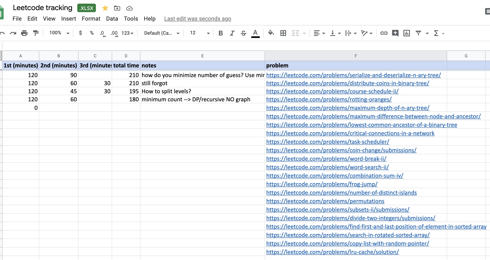

# Machine Learning Interview Preparation (MLIP)
## Intro
* Preparing for an ML engineer interview can take a lot of time to cover a wide range of technical areas i.e big data, ML fundamentals, deep learning fundamentals, Leetcode etc. I have only one goal: to save your time. I've been helping around 50 people to prepare for MLE interviews. Now I want to do it at a scale.

* The repo provides a **minimum** set of focus areas which cover all actual interview questions. I have interviewed for a lot of big companies (Facebook, Amazon, Apple, Google, MS, SnapChat, StitchFix, Intuit etc). I can not share specific interview questions due to NDA.

## Getting Started
1. [Common questions about Machine Learning Interview process](faqs.md). 
2. If you have never learnt ML, you should first go through the coursera machine learning course by Andrew Ng (or similar online courses). 
3. [Study guide](README.md) contained minimum set of focus area to aces your interview.  
4. [Machine Learning quiz](ready.md) are designed based on actual interview questions from dozen of big companies. 
5. [ML usecase](design.md) includes actual ML system design usecases. 
6. For advance topics, see [advance](extra.md)

## Focus area
### LeetCode

 I use [LC time tracking](https://docs.google.com/spreadsheets/d/1RCb1dVQCLmtOGlJ5J-NJ5pIC7Tda-N2U/edit#gid=274831950) to keep track of how many times I solves a question and how long I spent each time. Once I finish non-trivial medium LC questions 3 times, I have absolutely no issues solving them in actual interviews (sometimes within 8-10 minutes). It makes a big difference.

 [Leetcode questions by categories](leetcode.md)
### SQL
* Know SQL join: [self join](https://www.sqlservertutorial.net/sql-server-basics/sql-server-self-join/), inner, left, right etc. 
* Use [hackerrank](https://www.hackerrank.com/domains/sql) to practice SQL.

### Programming
* [Java garbage collection](https://stackify.com/what-is-java-garbage-collection/#:~:text=Java%20garbage%20collection%20is%20the,Machine%2C%20or%20JVM%20for%20short.&text=The%20garbage%20collector%20finds%20these,them%20to%20free%20up%20memory.)
* [Python pass-by-object-reference](https://robertheaton.com/2014/02/09/pythons-pass-by-object-reference-as-explained-by-philip-k-dick/)
* [Python GIL](https://realpython.com/python-gil/)
* [Python multithread](https://realpython.com/intro-to-python-threading/)
* [Python concurrency](https://realpython.com/python-concurrency/)

### Statistics and probability
* Learn Bayesian and practice [problems in Bayesian](https://blogs.kent.ac.uk/jonw/files/2015/04/Puza2005.pdf)
* Let A and B be events on the same sample space, with P (A) = 0.6 and P (B) = 0.7. Can these two events be disjoint?
* Alice has 2 kids and one of them is a girl. What is the probability that the other child is also a girl? 
* A group of 60 students is randomly split into 3 classes of equal size. All partitions are equally likely. Jack and Jill are two students belonging to that group. What is the probability that Jack and Jill will end up in the same class? 
* Assume we have a bag with 6 coins in it. 5 coins are fair, and 1 coin has heads on both sides. I randomly picked one coin from the bag, tossed it 3 times, and they were all heads. If I toss the coin again, what is the probability that it is still heads?
* Given an unfair coin with the probability of heads not equal to .5. What algorithm could you use to create a list of random 1s and 0s.  

### Big data
* Spark [architecture](http://datastrophic.io/core-concepts-architecture-and-internals-of-apache-spark/) and Spark [lessons learned](https://databricks.com/blog/2016/08/31/apache-spark-scale-a-60-tb-production-use-case.html) (outdated since Spark 3.0 release)  
* Spark [OOM](https://stackoverflow.com/questions/21138751/spark-java-lang-outofmemoryerror-java-heap-space)
* Cassandra [best practice](https://tech.ebayinc.com/engineering/cassandra-data-modeling-best-practices-part-1/) and [here](https://cassandra.apache.org/doc/latest/data_modeling/intro.html)

### ML fundamentals
* [Collinearity](https://statisticsbyjim.com/regression/multicollinearity-in-regression-analysis/) and [read more](https://www.youtube.com/watch?v=Cba9LJ9lS8s)
* [Features scaling](https://sebastianraschka.com/Articles/2014_about_feature_scaling.html)
* [Random forest vs GBDT](http://fastml.com/what-is-better-gradient-boosted-trees-or-random-forest/)
* [SMOTE synthetic minority over-sampling technique](https://arxiv.org/pdf/1106.1813.pdf)
* [Compare discriminative vs generative model](https://medium.com/@mlengineer/generative-and-discriminative-models-af5637a66a3) and [extra read](http://ai.stanford.edu/~ang/papers/nips01-discriminativegenerative.pdf)
* [Logistic regression](https://www.youtube.com/watch?v=-la3q9d7AKQ). Try to implement logistic regression from scratch. Bonus point for vectorized version in numpy + completed in 20 minutes. Followup with MapReduce version. 
* [Quantile regression](https://www.youtube.com/watch?v=s203ScTy4xQ&t=954s)
* [L1/L2 intuition](https://www.linkedin.com/pulse/intuitive-visual-explanation-differences-between-l1-l2-xiaoli-chen/)
* [Decision tree and Random Forest fundamental](https://people.csail.mit.edu/dsontag/courses/ml16/slides/lecture11.pdf)
* [Explain boosting](https://web.stanford.edu/~hastie/TALKS/boost.pdf)
* [Least Square as Maximum Likelihood Estimator](https://www.youtube.com/watch?v=_-Gnu498s3o)
* [Maximum Likelihood Estimator introduction](https://www.youtube.com/watch?v=jpHreXjtw1Q)
* [Kmeans](https://stanford.edu/~cpiech/cs221/handouts/kmeans.html). Try to implement Kmeans from scratch. Bonus point for vectorized version in numpy + completed in 20 minutes. Follow-up with worst case time complexity and improvement for initialization.
* I didn't use [flashcard](https://machinelearningflashcards.com/) but I'm sure it helps up to certain extend.

### DL fundamentals
* [The deep learning book](https://www.deeplearningbook.org/). Read [Part ii](https://www.deeplearningbook.org/contents/part_practical.html) 
* [Machine Learning Yearning](https://d2wvfoqc9gyqzf.cloudfront.net/content/uploads/2018/09/Ng-MLY01-13.pdf). Read from section 5 to section 27.
* [Neural network and backpropagation](http://cs231n.stanford.edu/slides/2020/lecture_4.pdf)
* [Activation functions](https://missinglink.ai/guides/neural-network-concepts/7-types-neural-network-activation-functions-right/)
* [Loss and optimization](http://cs231n.stanford.edu/slides/2020/lecture_3.pdf)
* [Convolution Neural network notes](https://cs231n.github.io/convolutional-networks/)
* [Recurrent Neural Networks](http://cs231n.stanford.edu/slides/2020/lecture_10.pdf)

### ML system design
#### ML classic paper
* [Technical debt in ML](https://papers.nips.cc/paper/5656-hidden-technical-debt-in-machine-learning-systems.pdf)
* [Ad click prediction trend](https://storage.googleapis.com/pub-tools-public-publication-data/pdf/41159.pdf)
* [Rules of ML](https://developers.google.com/machine-learning/guides/rules-of-ml)
* [An Opinionated Guide to ML Research](http://joschu.net/blog/opinionated-guide-ml-research.html). There is valuable advice in the Personal development section at the bottom.

#### ML productions
* [Scaling ML at Uber](https://eng.uber.com/scaling-michelangelo/)
* [DL in production](https://github.com/alirezadir/Production-Level-Deep-Learning)
#### Food delivery
* [Uber eats trip optimization](https://eng.uber.com/uber-eats-trip-optimization/)
* [Uber food discovery](https://eng.uber.com/uber-eats-query-understanding/)
* [Personalized store feed](https://blog.doordash.com/personalized-store-feed-with-vector-embeddings-251ad7a2c09a)
* [Doordash dispatch optimization](https://doordash.engineering/2020/02/28/next-generation-optimization-for-dasher-dispatch-at-doordash/)

#### Fraud detection (TBD)

#### Adtech
* [Delayed feedbacks](https://blog.twitter.com/engineering/en_us/topics/insights/2019/improving-engagement-on-digital-ads-with-delayed-feedback.html)
* [Entity embedding](https://blog.twitter.com/engineering/en_us/topics/insights/2018/embeddingsattwitter.html)
* [Star space, embedding all the things](https://arxiv.org/pdf/1709.03856.pdf)
* [Ad Clicks CTR](https://research.fb.com/wp-content/uploads/2016/11/practical-lessons-from-predicting-clicks-on-ads-at-facebook.pdf)
* [Twitter timeline ranking](https://blog.twitter.com/engineering/en_us/topics/insights/2017/using-deep-learning-at-scale-in-twitters-timelines.html)

#### Recommendations:
* [Instagram explore](https://ai.facebook.com/blog/powered-by-ai-instagrams-explore-recommender-system/)
* [TikTok recommendation](https://newsroom.tiktok.com/en-us/how-tiktok-recommends-videos-for-you)

# Acknowledgements and contributing
1. Thanks for early feedbacks and contributions from [Vivian](https://github.com/liuvivian11), [aragorn87](https://github.com/aragorn87) and others. 
2. You can create an Issue or Pull Request on this repo.
3. Send an email to helppreparemle@gmail.com or contact [me](https://www.linkedin.com/in/phamkhang/)