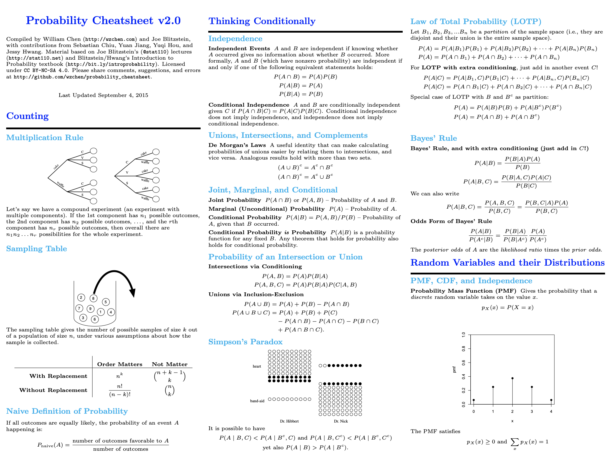

# Minimum Viable Study Plan for Machine Learning Interviews

 Machine Learning System Design - Early Preview  - <a href ="https://rebrand.ly/mldesignbook"> Buy on Amazon </a> 
 
 
 

 

 Machine Learning interviews book on Amazon. 

 

- Most popular post: [One lesson I learned after solving 500 leetcode questions](https://mlengineer.io/from-semiconductor-to-software-engineer-8c3126dde65b)
- Oct 10th: Machine Learning System Design course became the [number 1 ML course](https://www.linkedin.com/posts/activity-6853724396188790784-tWxj) on educative. 
- June 8th: launch [interview stories series](https://rebrand.ly/interviewstory). 
- April 29th: I launched [mlengineer.io](https://mlengineer.io/from-google-rejection-to-40-offers-71337a224ebe?sk=1408513db21536d25c23f67ce898b37d) blog so you can get latest machine learning interview experience.
- April 15th 2021: Machine Learning System Design is launched on [interviewquery.com](https://rebrand.ly/mldesigninterview).
- Feb 9th 2021: [Machine Learning System design](https://rebrand.ly/mlsd_launch) is now available on [educative.io](https://rebrand.ly/mlsd_launch).
- I'm a SWE, ML with 10 years of experience ([Linkedin profile](https://www.linkedin.com/in/phamkhang/)). I had offers from Google, LinkedIn, Coupang, Snap and StichFix. Read my [blog](https://rebrand.ly/mleio). 

## Machine Learning Design

| Section | |
| ------------- | ------------- | 
| 1. [Youtube Recommendation](https://rebrand.ly/mldesign) || 
| 2. [The main components in MLSD](https://rebrand.ly/mldesign) | | 
| 3. [LinkedIn Feed Ranking](https://rebrand.ly/mldesign) | | 
| 4. [Ad Click Prediction](https://rebrand.ly/mldesign)| | 
| 5. [Estimate Delivery time](https://rebrand.ly/mldesign)| | 
| 6. [Airbnb Search ranking](https://rebrand.ly/mldesign)| | 

## Getting Started

| How to  | Resources |
| ------------- | ------------- |
| List of promising companies | [WealthFront 2021 list](https://blog.wealthfront.com/career-launching-companies-list/#companies-list).   |
| Prepare for interview  | [Common questions about Machine Learning Interview process](faqs.md).   |
| Study guide | [Study guide](README.md) contained minimum set of focus area to aces your interview.   |
| Design ML system | [ML system design](https://mlengineer.io/machine-learning-design-interview-d08be9f44260?source=friends_link&sk=97fe3a510957d65b6311d5d38b30c639) includes actual ML system design usecases.    |
| ML usecases | [ML usecases](appliedml.md) from top companies    |
| Test your ML knowledge  | [Machine Learning quiz](https://mlengineer.io/machine-learning-assessment-db935aa9fafd?source=friends_link&sk=1062e407bea5d842b7684668b005d08c) are designed based on actual interview questions from dozen of big companies.  |
| One week before onsite interview | Read [one week check list](https://mlengineer.io/machine-learning-engineer-onsite-interview-one-week-checklist-cfd19d57fa02?source=friends_link&sk=80d2bb43c590156a7fa72260dfb4972c) |
| How to get offer? | Read [success stories](https://mlengineer.io/from-google-rejection-to-40-offers-71337a224ebe?source=friends_link&sk=1408513db21536d25c23f67ce898b37d) |
| FAANG companies actual MLE interviews | Read [interview stories](https://mlengineer.io/mlengineer-io-interview/home) |
| Practice coding  | [Leetcode questions by categories for MLE](https://mlengineer.io/common-leetcode-questions-by-categories-532b301130b)  |
| Advance topics | Read [advance topics](extra.md) |

## Study guide
### LeetCode (not all companies ask Leetcode questions)

- NOTE: there are a lot of companies that do **NOT** ask leetcode questions. There are many paths to become an MLE, you can create your own path if you feel like leetcoding is a waste of time. 

- I use [LC time tracking](https://docs.google.com/spreadsheets/d/1RCb1dVQCLmtOGlJ5J-NJ5pIC7Tda-N2U/edit#gid=274831950) to keep track of how many times I solves a question and how long I spent each time. Once I finish non-trivial medium LC questions 3 times, I have absolutely no issues solving them in actual interviews (sometimes within 8-10 minutes). It makes a big difference. A better way is to use **LeetPlug** chrome extension [here](https://leetplug.azurewebsites.net/static/pages/howto.html)

 [Leetcode questions by categories](https://mlengineer.io/common-leetcode-questions-by-categories-532b301130b?sk=cf77975462cb0c96e6a6daebaa3ab7b9)
### SQL
* Know SQL join: [self join](https://www.sqlservertutorial.net/sql-server-basics/sql-server-self-join/), inner, left, right etc. 
* Use [hackerrank](https://www.hackerrank.com/domains/sql) to practice SQL.
* Revise/Learn SQL Window Functions: [window functions](https://www.windowfunctions.com/questions/intro/)

### Programming
* [Java garbage collection](https://stackify.com/what-is-java-garbage-collection/#:~:text=Java%20garbage%20collection%20is%20the,Machine%2C%20or%20JVM%20for%20short.&text=The%20garbage%20collector%20finds%20these,them%20to%20free%20up%20memory.)
* [Python pass-by-object-reference](https://robertheaton.com/2014/02/09/pythons-pass-by-object-reference-as-explained-by-philip-k-dick/)
* [Python GIL, Fluent Python, chapter 17](http://index-of.es/Varios-2/Fluent%20Python%20Clear%20Concise%20and%20Effective%20Programming.pdf)
* [Python multithread](https://realpython.com/intro-to-python-threading/)
* [Python concurrency, Fluent Python, chapter 18](http://index-of.es/Varios-2/Fluent%20Python%20Clear%20Concise%20and%20Effective%20Programming.pdf)

### Statistics and probability

* The only cheatsheet that you''ll ever need

* Learn Bayesian and practice [problems in Bayesian](https://blogs.kent.ac.uk/jonw/files/2015/04/Puza2005.pdf)
* Let A and B be events on the same sample space, with P (A) = 0.6 and P (B) = 0.7. Can these two events be disjoint?
* Given that Alice has 2 kids, at least one of which is a girl, what is the probability that both kids are girls? (credit [swierdo](https://www.reddit.com/user/swierdo/))
* A group of 60 students is randomly split into 3 classes of equal size. All partitions are equally likely. Jack and Jill are two students belonging to that group. What is the probability that Jack and Jill will end up in the same class? 
* Given an unfair coin with the probability of heads not equal to .5. What algorithm could you use to create a list of random 1s and 0s.  

### Big data (NOT required for Google, Facebook interview)
* Spark [architecture](http://datastrophic.io/core-concepts-architecture-and-internals-of-apache-spark/) and Spark [lessons learned](https://databricks.com/blog/2016/08/31/apache-spark-scale-a-60-tb-production-use-case.html) (outdated since Spark 3.0 release)  
* Spark [OOM](https://stackoverflow.com/questions/21138751/spark-java-lang-outofmemoryerror-java-heap-space)
* Cassandra [best practice](https://tech.ebayinc.com/engineering/cassandra-data-modeling-best-practices-part-1/) and [here](https://cassandra.apache.org/doc/latest/data_modeling/intro.html), [link](https://towardsdatascience.com/when-to-use-cassandra-and-when-to-steer-clear-72b7f2cede76
), [cassandra performance](https://www.scnsoft.com/blog/cassandra-performance)
* Practice problem [finding friends with MapReduce](http://stevekrenzel.com/finding-friends-with-mapreduce)
* Everything in [one page](https://mlengineer.io/big-data-knowledge-for-machine-learning-engineer-interview-2020-148d7c335e12?source=friends_link&sk=604c593c522db5195d3bda33dc4662d7).

### ML fundamentals
* [Collinearity](https://statisticsbyjim.com/regression/multicollinearity-in-regression-analysis/) and [read more](https://www.youtube.com/watch?v=Cba9LJ9lS8s)
* [Features scaling](https://sebastianraschka.com/Articles/2014_about_feature_scaling.html)
* [Random forest vs GBDT](https://medium.com/@aravanshad/gradient-boosting-versus-random-forest-cfa3fa8f0d80)
* [SMOTE synthetic minority over-sampling technique](https://arxiv.org/pdf/1106.1813.pdf)
* [Compare discriminative vs generative model](https://medium.com/@mlengineer/generative-and-discriminative-models-af5637a66a3) and [extra read](http://ai.stanford.edu/~ang/papers/nips01-discriminativegenerative.pdf)
* [Logistic regression](https://www.youtube.com/watch?v=-la3q9d7AKQ). Try to implement logistic regression from scratch. Bonus point for vectorized version in numpy + completed in 20 minutes [sample code from martinpella](sample/logistic_regression.ipynb). Followup with MapReduce version. 
* [Quantile regression](https://www.youtube.com/watch?v=s203ScTy4xQ&t=954s)
* [L1/L2 intuition](https://www.linkedin.com/pulse/intuitive-visual-explanation-differences-between-l1-l2-xiaoli-chen/)
* [Decision tree and Random Forest fundamental](https://people.csail.mit.edu/dsontag/courses/ml16/slides/lecture11.pdf)
* [Explain boosting](https://web.stanford.edu/~hastie/TALKS/boost.pdf)
* [Least Square as Maximum Likelihood Estimator](https://www.youtube.com/watch?v=_-Gnu498s3o)
* [Maximum Likelihood Estimator introduction](https://www.youtube.com/watch?v=WflqTUOvdik&t=15s)
* [Kmeans](https://stanford.edu/~cpiech/cs221/handouts/kmeans.html). Try to implement Kmeans from scratch [sample code from flothesof.github.io](sample/kmeans.ipynb). Bonus point for vectorized version in numpy + completed in 20 minutes. Follow-up with worst case time complexity and improvement for [initialization](extra.md).
* Fundamentals about [PCA](http://alexhwilliams.info/itsneuronalblog/2016/03/27/pca/)
* I didn't use [flashcard](https://machinelearningflashcards.com/) but I'm sure it helps up to certain extend.

### AB testing
* [Trustworthy Online Controlled Experiments: A Practical Guide to A/B Testing](https://www.researchgate.net/publication/339914315_Trustworthy_Online_Controlled_Experiments_A_Practical_Guide_to_AB_Testing)

### DL fundamentals
* [The deep learning book](https://www.deeplearningbook.org/). Read [Part ii](https://www.deeplearningbook.org/contents/part_practical.html) 
* [Machine Learning Yearning](https://d2wvfoqc9gyqzf.cloudfront.net/content/uploads/2018/09/Ng-MLY01-13.pdf). Read from section 5 to section 27.
* [Neural network and backpropagation](http://cs231n.stanford.edu/slides/2020/lecture_4.pdf)
* [Activation functions](https://missinglink.ai/guides/neural-network-concepts/7-types-neural-network-activation-functions-right/)
* [Loss and optimization](http://cs231n.stanford.edu/slides/2020/lecture_3.pdf)
* [Convolution Neural network notes](https://cs231n.github.io/convolutional-networks/)
* [Recurrent Neural Networks](http://cs231n.stanford.edu/slides/2020/lecture_10.pdf)

### ML system design
#### ML classic paper
* [Technical debt in ML](https://papers.nips.cc/paper/5656-hidden-technical-debt-in-machine-learning-systems.pdf)
* [Rules of ML](https://developers.google.com/machine-learning/guides/rules-of-ml)
* [An Opinionated Guide to ML Research](http://joschu.net/blog/opinionated-guide-ml-research.html). There is valuable advice in the Personal development section at the bottom.

#### ML productions
* [Scaling ML at Uber](https://eng.uber.com/scaling-michelangelo/)
* [DL in production](https://github.com/alirezadir/Production-Level-Deep-Learning)
#### Food delivery
* [Uber eats trip optimization](https://eng.uber.com/uber-eats-trip-optimization/)
* [Uber food discovery](https://eng.uber.com/uber-eats-query-understanding/)
* [Personalized store feed](https://blog.doordash.com/personalized-store-feed-with-vector-embeddings-251ad7a2c09a)
* [Doordash dispatch optimization](https://doordash.engineering/2020/02/28/next-generation-optimization-for-dasher-dispatch-at-doordash/)

#### ML design common usecases
* [ML system design primer](https://interview.mlengineer.io/)
* [Video recommendation](https://interview.mlengineer.io/)
* [Feed ranking](https://interview.mlengineer.io/)

#### Fraud detection (TBD)

#### Adtech
* [Ad click prediction trend](https://storage.googleapis.com/pub-tools-public-publication-data/pdf/41159.pdf)
* [Ad Clicks CTR](https://research.fb.com/wp-content/uploads/2016/11/practical-lessons-from-predicting-clicks-on-ads-at-facebook.pdf)
* [Delayed feedbacks](https://blog.twitter.com/engineering/en_us/topics/insights/2019/improving-engagement-on-digital-ads-with-delayed-feedback.html)
* [Entity embedding](https://blog.twitter.com/engineering/en_us/topics/insights/2018/embeddingsattwitter.html)
* [Star space, embedding all the things](https://arxiv.org/pdf/1709.03856.pdf)
* [Twitter timeline ranking](https://blog.twitter.com/engineering/en_us/topics/insights/2017/using-deep-learning-at-scale-in-twitters-timelines.html)

#### Recommendations:
* [Instagram explore](https://ai.facebook.com/blog/powered-by-ai-instagrams-explore-recommender-system/)
* [TikTok recommendation](https://newsroom.tiktok.com/en-us/how-tiktok-recommends-videos-for-you)
* [Deep Neural Networks for YouTube Recommendations](https://storage.googleapis.com/pub-tools-public-publication-data/pdf/45530.pdf)
* [Wide & Deep Learning for Recommender Systems](https://arxiv.org/pdf/1606.07792.pdf%29/)

## Testimonials
- V, Amazon L5 DS
> I really found the quizzes very helpful for testing my ML understanding. Also, the resources shared helped me a lot for revising concepts for my interview preparation. This course will definitely help engineers crack Machine Learning Engineering and Data Science interviews.

- K, Facebook MLE
> I really like what you've built, it'll help a lot of engineers.

- D, NVIDIA DS
> I have been using your github repo to prep for my interviews and got an offer with NVIDIA with their data science team. Thanks again for your help!

- A, Booking
> Woow this is very useful summaries, so nice. 

- H, Microsoft
> That's incredible! 

- V, Intel
> The repo is extremely cohesive! Thanks again. 

## Intro

* This repo is written based on REAL interview questions from big companies and the study materials are based on legit experts i.e Andrew Ng, Yoshua Bengio etc. 

* I have 6 YOE in Machine Learning and have interviewed more than dozen big companies. This is the **minimum** viable study plan that covers all actual interview questions from Facebook, Amazon, Apple, Google, MS, SnapChat, Linkedin etc. 

* If you're interested to learn more about paid ML system design course, [click here](course.md). This course will provide 6-7 practical usecases with proven solutions. After this course you will be able to solve new problem with systematic approach.

# Acknowledgements and contributing
1. Thanks for early feedbacks and contributions from [Vivian](https://github.com/liuvivian11), [aragorn87](https://github.com/aragorn87) and others. You can create an Issue or Pull Request on this repo. You can also help upvote on [ProductHunt](https://www.producthunt.com/posts/machine-learning-interview-guideline)

2. If you find this helpful, you can Sponsor this project. It's cool if you don't. 

3. Thanks to this community, we have donated about $200 to [HopeForPaws](https://www.hopeforpaws.org/). If you want to support, you can contribute too on their website. 

