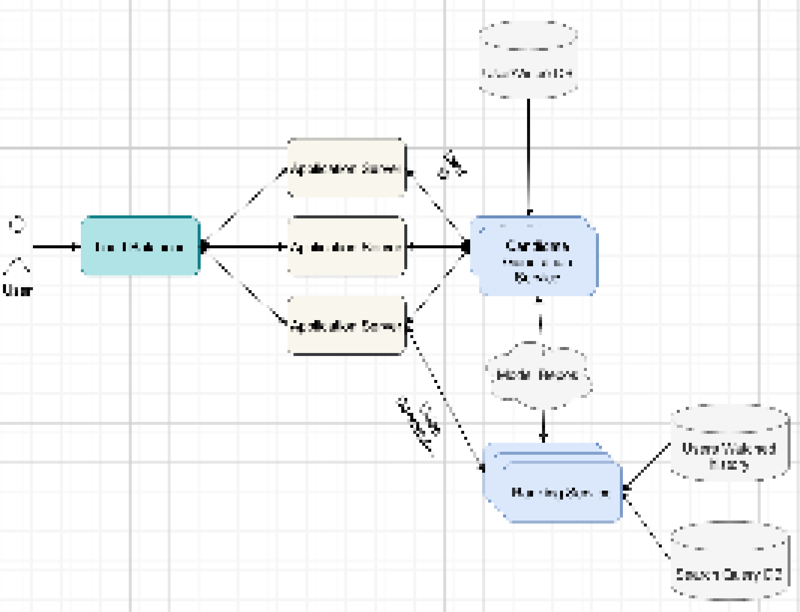
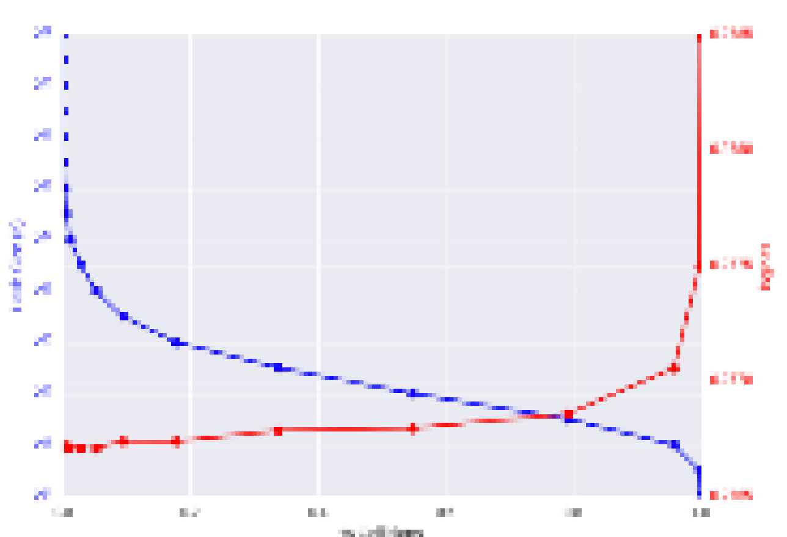
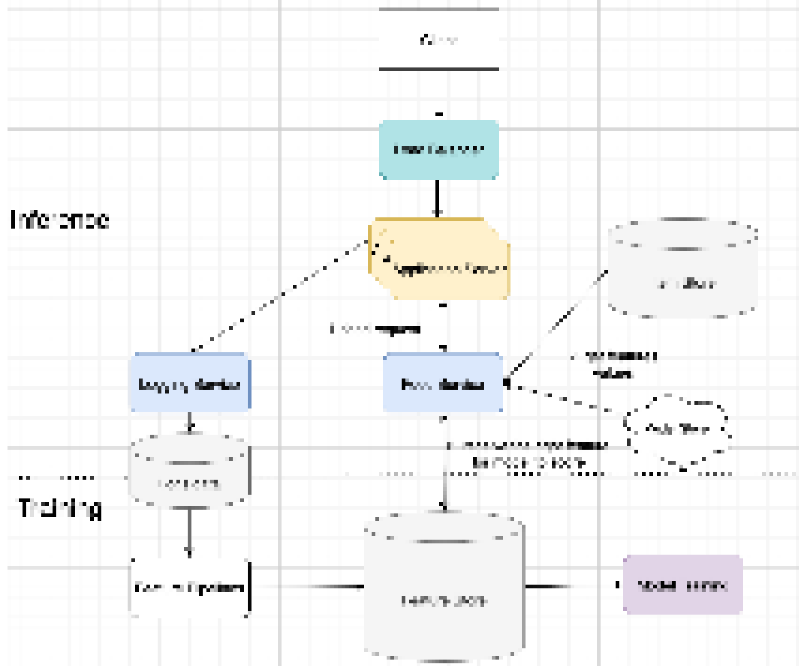
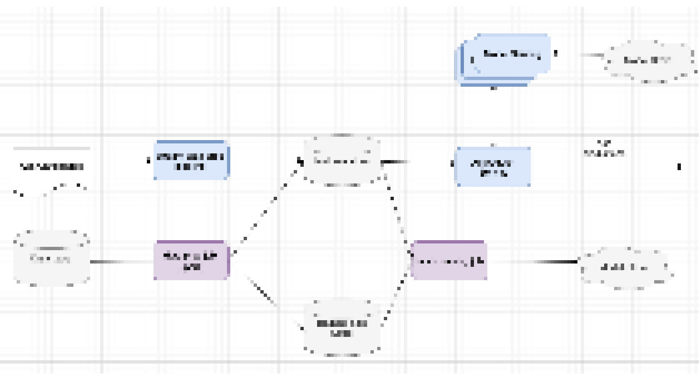
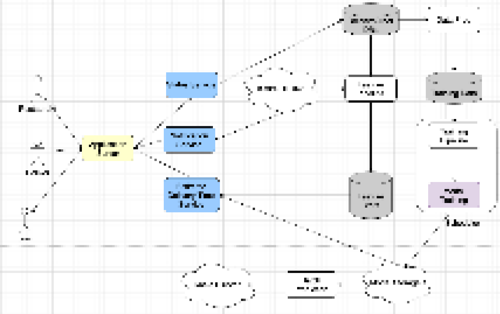
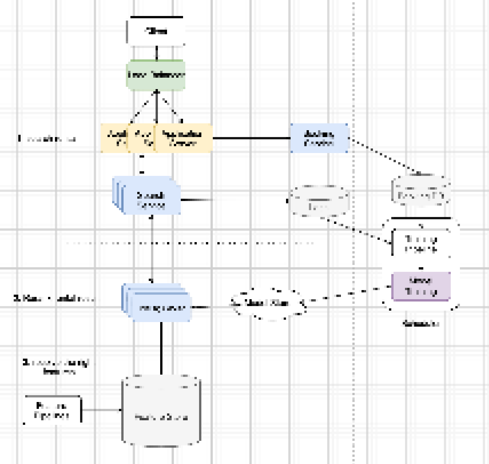
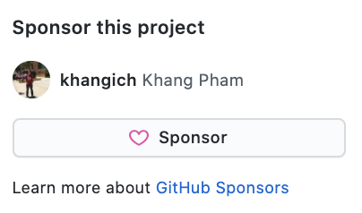

# Machine Learning System Design course
## Course content
| Section | |
| ------------- | ------------- | 
| 1. [Youtube Recommendation](https://rebrand.ly/mldesign) || 
| 2. [The main components in MLSD](https://rebrand.ly/mldesign) | | 
| 3. [LinkedIn Feed Ranking](https://rebrand.ly/mldesign) | | 
| 4. [Ad Click Prediction](https://rebrand.ly/mldesign)| | 
| 5. [Estimate Delivery time](https://rebrand.ly/mldesign)| | 
| 6. [Airbnb Search ranking](https://rebrand.ly/mldesign)| | 

- All course contents are subjected to changed based on actual demands. If you want to subscribe the course [click here](https://github.com/sponsors/khangich) and become sponsor or pay one time fee $50 [here](https://www.paypal.com/paypalme/MLinterviews). Please follow instructions below.

## System design sample
- You can see the sample of ML system design [here](https://docs.google.com/document/d/12KrfFYxiqCVmjmHiOfIoqBWuOuZEBXcL1RjWFkY7hLk/edit#). 
- Another [sample](https://github.com/khangich/machine-learning-interview/blob/master/design.md)

## Frequently asked questions (MUST read before subscribe)
- Who should NOT subscribe to this course? New grad, people applied for data scientist, research scientist, software engineer positions. People will have onsite interview tomorrow or 1 year from now. 
- Do you guarantee the sytem design is good enough for me to get a job? No. 
- Did you copy the solution from the internet? No.
- How do I know the solutions are good? Solutions are based on actual production and well-known published papers. 
- Can I get a refund if I'm not satisfied? No, I can't do it because it's too complicated. 
- Can I stop subscription? You can stop your subscription any time. You won't be able to access the course.
- Do you have working solution with code and data? No, it's impossible. 
- Will you in the future release the whole course for free? No
- Can I request system design usecase? Yes, you can [request here](https://forms.gle/ALsKMik5ocwptUZh7)
- For further questions, please send email helppreparemle@gmail.com. 

## How to start learning ML system design? (available Now)
- You need to become the sponsor to be able to access the course. Your sponsorship is crucial for me to make high quality content. In general I spend 40 hours to finish one MLSD. 

- Step 1: click the Sponsor button then follow instruction. 

- Step 2: Go to [online course](https://docs.google.com/document/d/15XIFNS23oWEttgot1ILL3yxWQqGYHnRn8Jh3YyCer3s/edit). You will receive system design in google docs. 
- Check your email for the online course link (within 2 hours)

## Notes
* If you find this helpful, you can Sponsor this project. It's cool if you don't. 
