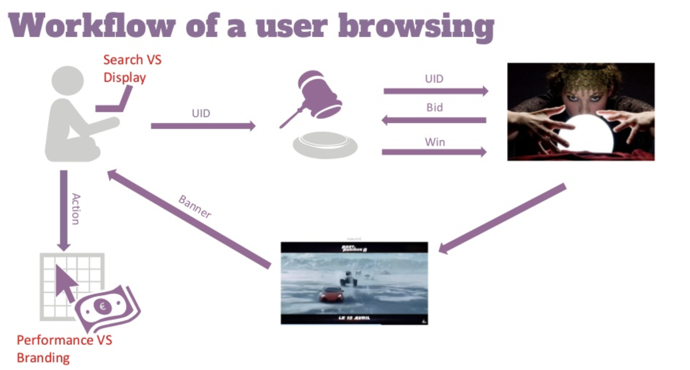
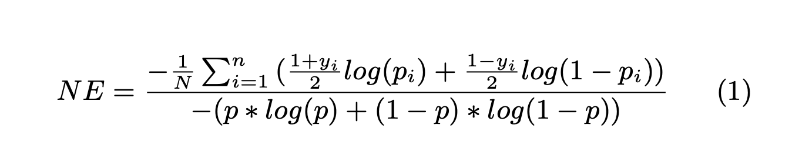
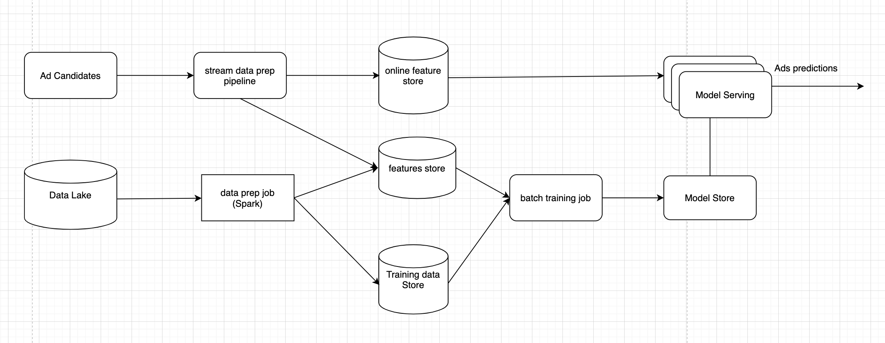

# ML system design usecases
* The goal of this section is to provide a structural way to approach ML system design questions. If you're interested to learn more about paid ML system design course with more examples, [click here](https://rebrand.ly/interviewml).

## Ad Click Prediction for Social Networks. 
* Build a machine learning model to predict if an ad will be clicked. For simplicity reasons, 
we will not focus on the cascade of classifiers that's commonly used in adtech. 

* Background on how Adtech bidding works (source: [ML in AdTech](https://www.slideshare.net/databricks/machine-learning-for-adtech-in-action-with-cyrille-dubarry-and-han-ju))

1. Requirements
* ML model with good performance. 
* System can scale to larger number of users with low latency. 
* Imbalance data: you can assume Click Through Rate (CTR) is very small in practice (1%-2%). 
* Serving: from the RTB worfklow diagram, it's important to have low latency (150 ms) for ad prediction. 

2. Calculate and estimation
* Assumptions: 4K ads requests per second which is 10 billions ads requests per month. 
* Data: historical ad clicks data includes [user, ads, click_or_not]. With estimated 1% CTR, it has 100 millions clicked ads. We can start with 1 month of data for training and validation. 

* Train/validation data split: We split train/validation to simulate the actual online system for example: split by time. 

* Features: it's natural that the model need to have enough capacity to learn patterns from big training data. In practice it's common to have hundreds even thousands of features. 

* Training: ability to retrain many times within one day to increase model performance in online manner. 

* Serving: latency within 150ms per request and 4K request per second. 

3. Metrics evaluation
* During the training phase, we can focus on machine learning metrics instead of revenue metrics or CTR metrics. Regarding revenue-related metrics, we usually monitor during deployment and it's out of scope. See section 7 further readings to understand about offline metrics and online metrics. 
* Normalized Cross Entropy: predictive log loss divided by the cross entropy of the background CTR. This way NCE is insensitive to background CTR. This is the NCE formula (source [facebook](https://research.fb.com/wp-content/uploads/2016/11/practical-lessons-from-predicting-clicks-on-ads-at-facebook.pdf))

* Calibration metrics measured by the expected clicks vs the actual observed clicks. Read more about calibration [here](https://arxiv.org/pdf/1706.04599.pdf)

4. Modeling: features scaling, major sub-sambling. 
* Model: We can use probabilistic sparse linear classifier (logistic regression). It's popular because of the computation efficiency and sparsity features.
* Feature engineering:
    * AdvertiserID: it's easy to have millions of advertisers. One common way is to use embedding as a distributed representation for advitiserID. If you're not familiar with [embedding](https://blog.twitter.com/engineering/en_us/topics/insights/2018/embeddingsattwitter.html). Another way is to use [feature hashing by Kilian Weinberger](https://arxiv.org/pdf/0902.2206.pdf) to handle large sparse column. Feature hashing helps increase speed and reduce memory usage. See video [here](https://www.coursera.org/lecture/machine-learning-applications-big-data/hashing-trick-GswXH). 
    * Numeric columns: pay attention to [feature scaling](https://www.datacamp.com/community/tutorials/preprocessing-in-data-science-part-2-centering-scaling-and-logistic-regression).

* Data processing:
    * One way is subsampling majority negative class at different sub-sampling ratio. The key here is ensuring that the validation dataset has the same distribution as the test data set. We also need to pay attention how this sampling affect predictions. 

5. Model deployment and testing
* During deployment phase, it's crucial to monitor the actual CTR and other revenue-related metrics.
* Related to this topic, read more about A/B testing and multi-arms bandit.

6. High level system design

7. Further readings
* [Common ML designs](https://rebrand.ly/interviewml)
* [Machine Learning in Adtech](https://www.slideshare.net/databricks/machine-learning-for-adtech-in-action-with-cyrille-dubarry-and-han-ju)
* [Ad Click Prediction: a View from the trenches](https://storage.googleapis.com/pub-tools-public-publication-data/pdf/41159.pdf)
* [Practical lessons from Predicting Clicks on Ads at Facebook](https://research.fb.com/wp-content/uploads/2016/11/practical-lessons-from-predicting-clicks-on-ads-at-facebook.pdf)
* [Predictive Model Performance: Offline and Online Evaluation](http://chbrown.github.io/kdd-2013-usb/kdd/p1294.pdf)
* [Kaggle CTR prediction](https://www.kaggle.com/c/avazu-ctr-prediction/overview)

# Notes
* If you're interested to learn more about paid ML system design course with more examples, [click here](https://rebrand.ly/mlsd_launch).
* If you find this helpful, you can Sponsor this project. It's cool if you don't. 
