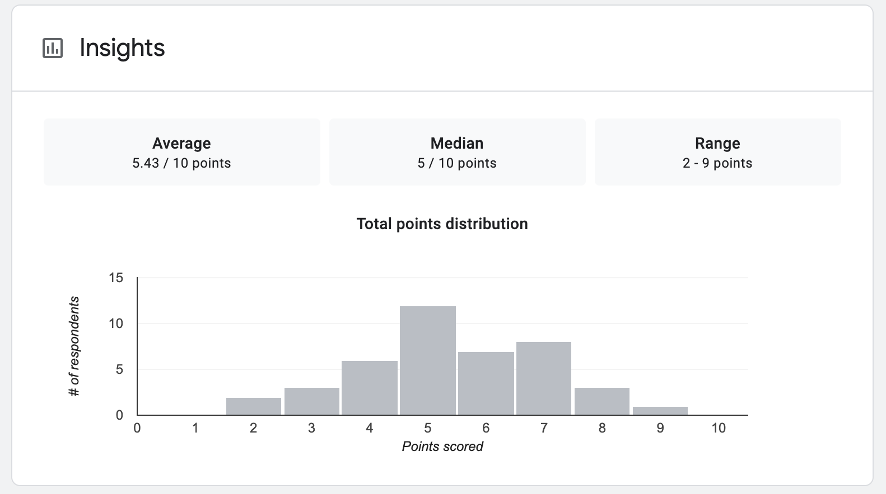

# Machine Learning Quiz

## List of quizzes

| Quiz | Release date | Number of people took quiz | Top 5% score |
| ------------- | ------------- |------------- |------------- |
|ML quiz, upcoming | 9/30/2020 |  | |
|[ML quiz 531 (difficult level)](https://forms.gle/dLK8TE6NLoWNU1LV6)| 5/30/2020 | 20 | 9 |
|[ML quiz 12 (medium level)](https://forms.gle/aieiHULBTHRYpNH59)| April 2020 | 66 | 9 |

## Quiz statistics
* If you can score 9/10 corrected questions, you are quite ready for ML interview. I have prepared ML tests based on real questions at big companies i.e: FAAG, Linkedin, Snapchat etc... Send an email to helppreparemle@gmail.com for solution. 

* ML quiz 12 statistics

## ML system design readiness
* See [design](design.md)

# Notes
* If you're interested to learn more about paid ML system design course with more examples, [click here](course.md).
* If you find this helpful, you can Sponsor this project. It's cool if you don't. 

